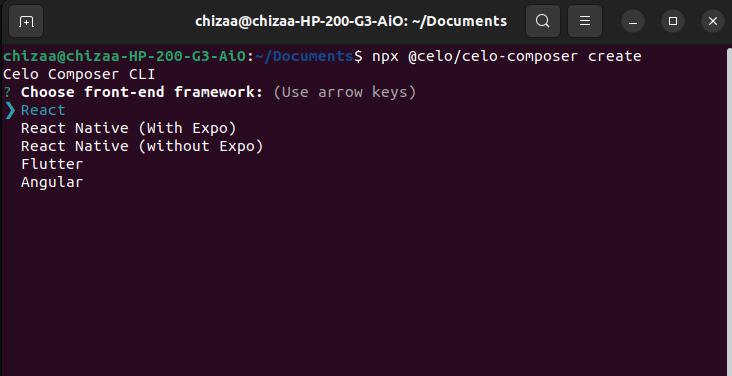
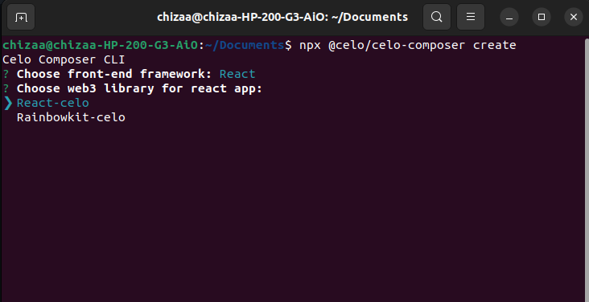
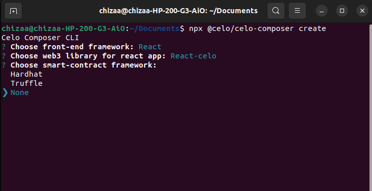
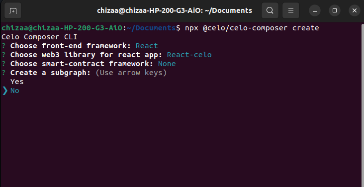
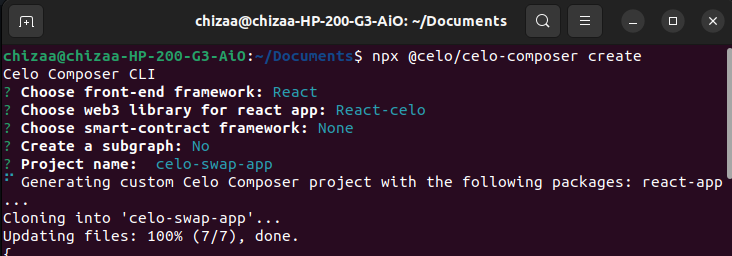
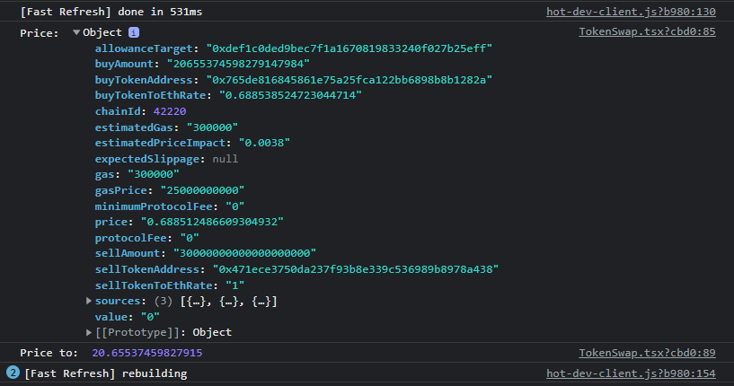
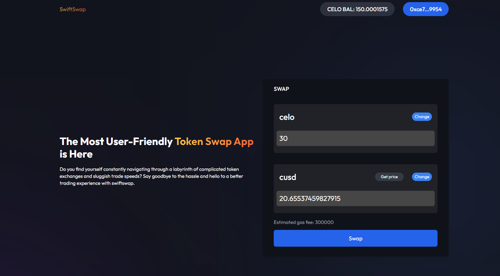

# Build a simple token swap app using Celo Composer and 0x Protocol.

In this build, we will be learning how to create a token swap application for tokens in the celo ecosystem.

Here’s the stack that we will be working with:

- NextJS - React framework
- Typescript
- 0x Protocol API
- React Celo
- TailwindCSS for styling

## **Celo composer**

The easiest way to get started with Celo Composer is using `@celo/celo-composer`
. This is a CLI tool enables you to quickly start building dApps on Celo for multiple frameworks including React, React Native (w/o Expo), Flutter and Angular. You can create the dApp using default Composer templates provided by Celo. In our case, we will work with react, specifically NextJS.

## **0x Protocol API**

0x is an open-source, decentralized exchange infrastructure that enables the exchange of tokenized assets on multiple blockchains.

The 0x protocol is, at its core, a set of secure smart contracts that facilitate the peer-to-peer exchange of [Ethereum](https://ethereum.org/en/) based assets. The protocol serves as an open standard and common building block for any developer needing exchange functionality.

Lets start building:

# **Bootstrap the application**

1. Bootstrap the application using celo composer command.

```jsx
npx @celo/celo-composer create
```

1. Select React framework(NextJS)



1. Select react-celo as the web3 library



1. Select none for the smart contract framework since we’ll be working with 0x Protocol API.



1. Select No for subgraph
    
    
    

1. Give a name to your project and your done.



Launch the app in your code editor then install the dependencies required in the project. In the root directory, run 

```jsx
yarn 

//or

npm install
```

# Build the UI

We’re going to be working with this [Figma design](https://www.figma.com/file/yMOnBRWcbdcN7WziPz8Pxb/Swap-app?node-id=3%3A19&t=pHCSaatJuwfOewz0-1).

### Build Layout

In the pages directory, create a layout component that will render the

```jsx
//pages/Layout

import { FC, ReactNode } from "react";
import Header from "../components/Header";

interface Props {
    children: ReactNode
}
const Layout: FC<Props> = ({children}) => {
    return (
        <>
            <div className="bg-hero-desktop-bg bg-cover bg-no-repeat h-screen">
            <Header />
                <div className="py-16 max-w-7xl mx-auto mt-16 space-y-8 sm:px-6 lg:px-8">
                    {children}
                </div>
            
            </div>
        </>
    )
}

export default Layout;
```

### Show wallet balance

In the header component, we will display the logo, connect wallet button and wallet balance. 

```jsx
//components/Header.tsx

...
const [summary, setSummary] = useState<Summary>(defaultSummary);
   let { address, kit } = useCelo();

    async function getBalances(
      stableTokens: {
        symbol: StableToken;
        contract: StableTokenWrapper | null;
      }[],
      address: string
    ) {
      return Promise.all(
        stableTokens.map(async (stable) => {
          let value, error;
          if (stable.contract) {
            value = await stable.contract.balanceOf(address);
          } else {
            error = "not deployed in network";
          }
          return {
            symbol: stable.symbol,
            value: value,
            error: error,
          };
        })
      );
    }

    const fetchSummary = useCallback(async () => {
      if (!address) {
        setSummary(defaultSummary);
        return;
      }

      const [accounts, goldToken, stableTokens] = await Promise.all([
        kit.contracts.getAccounts(),
        kit.contracts.getGoldToken(),
        Promise.all(
          Object.values(StableToken).map(async (stable) => {
            let contract;
            try {
              contract = await kit.contracts.getStableToken(stable);
            } catch (e) {
              contract = null;
              console.error(e);
            }
            return {
              symbol: stable,
              contract: contract,
            };
          })
        ),
      ]);

      const [accountSummary, celo, balances] = await Promise.all([
        accounts.getAccountSummary(address).catch((e) => {
          console.error(e);
          return defaultSummary;
        }),
        goldToken.balanceOf(address),
        getBalances(stableTokens, address),
      ]);

      setSummary({
        ...accountSummary,
        celo,
        balances,
      });
    }, [address, kit]);

    useEffect(() => {
      void fetchSummary();
    }, [fetchSummary]);

...

<div className="space-x-6">
          <p className=" text-white inline-flex content-center place-items-center rounded-full py-2 px-5 text-md font-medium text-snow ">
            CELO BAL: {Web3.utils.fromWei(summary.celo.toFixed())}
          </p>
        </div>

...
```

The **`useCelo`**hook is a convenient way to integrate Celo blockchain functionality into React applications. By using this hook, developers can easily interact with the blockchain network, retrieve data, and trigger transactions from within their React components.

When used in a function component, the **`useCelo`** hook returns an object with the following properties:

- **`kit`**: an instance of the **`ContractKit`** class from the Celo SDK that provides a simple interface to interact with the Celo network. This object includes methods for interacting with smart contracts and accounts, as well as other blockchain-related functionality.
- **`address`**: the Ethereum address of the currently selected account.

The **`fetchSummary`** function uses a **`useCallback`** hook that retrieves the user's account summary, including their CELO balance and stable token balances. The **`useEffect`** hook is used to trigger the **`fetchSummary`**function when the component mounts or when its dependencies change.

### Home Page

```jsx
//pages/Layout

import TokenSwap from "@/components/TokenSwap";

const Home = () => {
    
  return (
    <div className="text-white w-11/12 mx-auto grid grid-cols-1 sm:grid-cols-2 sm:space-x-6 space-y-10  items-center ">
      <div className="flex flex-col space-y-4 ">
        <h1 className="text-3xl font-bold">
          The Most User-Friendly{" "}
          <span className="bg-gradient-to-r from-[#FFC947] to-[#FC6739] text-transparent bg-clip-text">
            Token Swap App
          </span>{" "}
          is Here
        </h1>
        <p className="text-sm">
          Do you find yourself constantly navigating through a labyrinth of
          complicated token exchanges and sluggish trade speeds? Say goodbye to
          the hassle and hello to a better trading experience with swiftswap.
        </p>
      </div>
      <div>
        <TokenSwap />
      </div>
    </div>
  );
};

export default Home;
```

### Add tokens json

Inside a data directory and create a  token.json file an array of objects with ERC20 tokens details in the celo ecosystem.  

### **Create the swap component**

In the components directory, create a TokenSwap.tsx file.

```tsx
//components/TokenSwap.tsx

import React, { useState } from "react";
import { Token } from "@/typings";

export default function TokenSwap() {
 // Extract the account address from their wallet
  let { address } = useCelo();
  
  const [tokenFrom, setTokenFrom] = useState<Token>({
    id: "celo-dollar",
    symbol: "cusd",
    name: "Celo Dollar",
    platforms: {
      "celo": "0x765de816845861e75a25fca122bb6898b8b1282a",
      "near-protocol": "cusd.token.a11bd.near",
    },
  });

  const [tokenTo, setTokenTo] = useState<Token>({
    id: "",
    symbol: "",
    name: "",
    platforms: {},
  });

  // Prices +
  const [amountEntered, setAmountEntered] = useState<string>("0");
  const [amountTo, setAmountTo] = useState<number>(0);

  const [isOpen, setIsOpen] = useState<boolean>(false);
  const [choice, setChoice] = useState<string>("to");
  const [gasPrice, setGasPrice] = useState<number>(0.0);

  const open = (choiceType: string) => {
    setChoice(choiceType);
    setIsOpen(true);
  };

  const close = () => setIsOpen(false);

  const selectToken = (token: Token, choice: string) => {
    if (choice === "from") {
      setTokenFrom(token);
      setIsOpen(false);
    } else {
      setTokenTo(token);
      setIsOpen(false);
    }
  };

  const handleAmountChange = (e: React.ChangeEvent<HTMLInputElement>) => {
    const value = e.target.value;
    setAmountEntered(value);
  };
  return (
    <>
      {tokenFrom.symbol === tokenTo.symbol && (
        <div className="flex text-red-400 font-medium flex-row self-center bg-red-50 px-4 py-2 text-sm rounded-md mb-3 border-2 border-red-400">
          <h4>Swap tokens can not be the same</h4>
        </div>
      )}
      <div className="flex flex-1 w-full h-full items-center justify-center ">
        <div className="p-2 px-8 py-4 shadow-md  bg-[#10121a] w-full rounded-lg">
          <h1 className="font-medium">SWAP</h1>

          <div className="w-full p-2 bg-[#464646]/30 rounded-md my-8">
            <div className="flex px-2 py-3 flex-row items-center justify-between">
              <h1 className="text-2xl font-medium">{tokenFrom.symbol}</h1>

              <button
                onClick={() => open("from")}
                className="text-white text-xs bg-blue-500  rounded-full px-2 py-1"
              >
                Change
              </button>
            </div>

            <input
              type="number"
              placeholder="0.0"
              value={amountEntered}
              onBlur={()=> {}}
              onChange={handleAmountChange}
              className="bg-[#464646]  text-xl outline-none my-3 w-full rounded-md p-2"
            />
          </div>

          <div className="w-full p-2 bg-[#464646]/30 rounded-md my-4">
            <div className="flex px-2 py-3 flex-row items-center justify-between">
              {!tokenTo.symbol ? (
                <button
                  onClick={() => open("to")}
                  className="text-lg bg-blue-500 text-white rounded-full px-4 py-2 font-medium"
                >
                  Select a token
                </button>
              ) : (
                <>
                  <h1 className="text-2xl font-medium">{tokenTo.symbol}</h1>
                  <div className="flex space-x-6">
                    <button
                      onClick={() => {}}
                      className=" bg-gray-500/30 text-white text-xs rounded-full px-4 py-1"
                    >
                      Get price
                    </button>

                    <button
                      onClick={() => open("to")}
                      className="text-white text-xs bg-blue-500 rounded-full px-2 py-1"
                    >
                      Change
                    </button>
                  </div>
                </>
              )}
            </div>

            <input
              type="number"
              placeholder="0.0"
              disabled
              value={amountTo ? amountTo : 0.0}
              className="bg-[#464646] text-xl outline-none cursor-not-allowed my-3 w-full rounded-md p-2"
            />
          </div>

          {tokenFrom.symbol != tokenTo.symbol && (
            <>
              <p className="text-gray-400 text-sm">
                Estimated gas fee: 0.100
              </p>

              {amountEntered && tokenTo.symbol ? (
                <button
                  onClick={() => {}}
                  className="w-full p-3 my-3 bg-blue-600 rounded-md text-white"
                >
                  Swap
                </button>
              ) : (
                <button
                  disabled
                  className="w-full p-3 my-3 cursor-not-allowed bg-[#464646]/30  rounded-md text-gray-600"
                >
                  Swap
                </button>
              )}
            </>
          )}
        </div>
      </div>
 
    </>
  );
}
```

The **`useState`**hook is used to create and manage state variables in a functional component in React. Whenever a state variable is updated using its corresponding **`set`** function, React re-renders the component and updates the UI to reflect the new state. Each state variable created with **`useState`** is assigned a default initial value, which is passed as an argument to the **`useState`** function. In the code provided, the initial values of each state variable are set using various data types, such as strings, numbers, and objects.

- **`setTokenFrom`**and **`setTokenTo:`** update the state of the tokens being swapped**.**
- **`setAmountEntered`**and **`setAmountTo:`** update the state of the **`amountEntered`**and **`amountTo`** variables.
- **`setIsOpen`** and **`close()` function** handles the opening and closing of the tokens modal.
- **`setChoice`**  verifies what action the user is performing. For example, if the user selects from or selects a particular token.
- **`setGasPrice`** handles setting the estimated gas fee between the tokens

Inside the tokens swap component, import TokensModal.tsx and pass the necessary props required.

```tsx
import TokensModal from "./TokensModal";

...
<TokensModal
        isOpen={isOpen}
        close={close}
        choice={choice}
        selectToken={selectToken}
/>

```

### Set up types

Create typings.d.ts file that will contain types used in the application.

```tsx
type Platform = {
  [key: string]: string;
};

export interface Token {
  id?: string;
  symbol?: string;
  name?: string;
  platforms: Platform;
}

export interface ModalProps {
  isOpen: boolean;
  close: () => void;
  choice: string;
  selectToken: (token: Token, choice: string) => void;
}

export interface Summary {
  name: string;
  address: string;
  celo: BigNumber;
  balances: { symbol: StableToken; value?: BigNumber; error?: string }[];
}

type AbiItem = {
  constant: boolean;
  inputs: { name: string; type: string }[];
  name: string;
  outputs: { name: string; type: string }[];
  payable: boolean;
  stateMutability: string;
  type: string;
  anonymous?: boolean;
};

export type Abi = AbiItem[];
```

### Build tokens modal

Inside a components directory and create a TokensModal.tsx file to render a list of celo ERC20 tokens.

```tsx
import tokensList from "@/data/tokens.json";
import { ModalProps } from "@/typings";
import React from "react";

export default function TokensModal({
  isOpen,
  close,
  choice,
  selectToken,
}: ModalProps) {
  return (
    <>
      {isOpen && (
        <>
          <div className="justify-center items-center flex overflow-x-hidden overflow-y-auto fixed inset-0 z-50 outline-none focus:outline-none bg-[#0e1016]/80">
            <div className="relative my-6 mx-auto w-2/5">
              <div className="border-0 rounded-lg shadow-lg relative flex flex-col w-full bg-[#1e2231] outline-none focus:outline-none">
                <div className="flex items-start justify-between p-3 border-b border-solid border-slate-200 rounded-t">
                  <h3 className="text-xl font-semibold">Select token </h3>
                  <button
                    className="p-1 ml-auto bg-transparent border-0 text-black opacity-5 float-right text-3xl leading-none font-semibold outline-none focus:outline-none"
                    onClick={close}
                  >
                    <span className="bg-transparent text-black opacity-5 h-6 w-6 text-2xl block outline-none focus:outline-none">
                      ×
                    </span>
                  </button>
                </div>

                <div className="relative p-3 px-0 flex-auto overflow-y-scroll max-h-96">
                  {tokensList.map((item) => (
                    <div
                      key={item.id}
                      onClick={() => selectToken(item as any, choice)}
                      className="w-full px-4 mb-2 py-2 cursor-pointer justify-between border-b-[0.5px] hover:bg-[#242424] flex flex-col "
                    >
                      <h1 className="text-xl ">{item.name}</h1>
                      <h1 className="text-sm text-green-500">{item.symbol}</h1>
                    </div>
                  ))}
                </div>

                <div className="flex items-center justify-end p-3 border-t border-solid border-slate-200 rounded-b">
                  <button
                    className="text-red-500 background-transparent font-bold uppercase px-6 py-2 text-sm outline-none focus:outline-none mr-1 mb-1 ease-linear transition-all duration-150"
                    type="button"
                    onClick={close}
                  >
                    Cancel
                  </button>
                </div>
              </div>
            </div>
          </div>
          <div className="opacity-25 fixed inset-0 z-40 bg-black"></div>
        </>
      )}
    </>
  );
}
```

Within the component, the `tokensList` variable is imported from a JSON file and mapped over to create a list of clickable token items. Each item displays the token name and symbol, and when clicked, it triggers the `selectToken` function with the selected token object and the current choice string as parameters.

## Fetch swap price.

Our users can successfully select the tokens they want to swap. Let's help them find the best swap price.

A common functionality in most DEX apps is the ability to automatically generate a swap price when a user enters the token amount from value.

We want to automatically determine this price without letting the user explicitly press a button to see the price. We'll achieve this through the `onBlur()` function, which will call the `getPrice()` function that we'll define later.

`getPrice()` will fetch the price details of the swap and will show the user the token amount they'll receive, as well as the estimated gas fees that will cost the user.

Before we define the `getPrice()` function, we need to monitor some state variables for the app:

- `amountEntered`: Handles the amount of token entered by the user.
- `amountTo`: Will be prefilled by the amount to `tokenTo` which the user will receive after the swap is successful
- `gasPrice`: Will be prefilled by the estimated gas prices that the transaction will cost.

```jsx
//Fetch swap price
  const getPrice = async () => {
    if (!tokenFrom.symbol || !tokenTo.symbol || !amountEntered) return;

    // Get amount by calculating it from the smallest base unit of a standard erc20 token which is 18
    let amount = Number(amountEntered) * 10 ** 18;

    // set the params
    const params = {
      sellToken: tokenFrom.platforms.celo
        ? tokenFrom.platforms.celo
        : tokenFrom.symbol,
      buyToken: tokenTo.platforms.celo
        ? tokenTo.platforms.celo
        : tokenTo.symbol,
      sellAmount: amount,
    };

    // Fetch the swap price.
    const response = await fetch(
      `https://celo.api.0x.org/swap/v1/price?${qs.stringify(params)}`
    );

    // Await and parse the JSON response
    const priceResult = await response.json();
    console.log("Price: ", priceResult);

    const pricesConverted = priceResult.buyAmount / 10 ** 18;
    setAmountTo(pricesConverted);
    console.log("Price to: ", pricesConverted);

    setGasPrice(priceResult.estimatedGas);
  };
```

Finally, we can now submit our swap params info to the 0x price endpoint.

The 0x endpoint requires us to stringify the `params` object and pass it to the URL of the endpoint.

In this case, we used an external library called `qs` to stringify the parameters properly.

```jsx
npm i qs 

npm i --save-dev types/qs
```

Notice how we've prefixed the 0x endpoint with https://celo at the beginning. This is because we want to fetch the prices from the celo network.

We continue to parse the result and convert the price from `priceResult.buyAmount` and get the estimated gas price from `priceResult.estimatedGas`.

The `getPrice()` function is almost done. Now we need to call it in the `onBlur()` of the input field of the `tokenFrom` component.

Add to the input:

```tsx
...

<input
    type="number"
    placeholder="0.0"
    value={amountEntered}
    onChange={handleAmountChange}
    onBlur={getPrice}
    className="bg-[#464646]  text-xl outline-none my-3 w-full rounded-md p-2"
/>

...
```

We've added the `onBlur()` to automatically call the `getPrice()` when the user is done typing in the data. This will return the price quote and prefill them accordingly.

In the app's UI, select swap tokens respectively and enter in a price to see our price logs.

Output log:



Adding all the necessary prices variables, our app UI completely prefills all the necessary data as shown below:



## Create a price quote

We can successfully connect the user to their MetaMask wallet account. Now we can use the 0x `v1/quote` endpoint to create a swap quote for the user.

As we covered before, the price quote endpoint created from 0x returns a signable object that a user can submit as a transaction to complete the swap transaction.

To achieve this, we must retrieve the user's account address from their wallet and pass it in as the `takerAddress`.

We'll use the user address info from the `useCelo()` function that comes with the `@celo/react-celo` package we installed earlier.

We'll extract the current user address from their wallet by importing the `useCelo()` function and extracting the `address` from it as shown below:

```jsx
import { useCelo } from "@celo/react-celo";

...
// Extract the account address from their wallet
let { address } = useCelo();
```

Now that we have the user's account address we can create a `getQuote()` in your component. This will be called by the swap button when the user is ready to implement the swap finally.

```jsx
const getQuote = async () => {
    if (!tokenFrom.symbol || !tokenTo.symbol || !amountEntered) return;

    // Get amount by calculating it from the smallest base unit of a standard erc20 token which is 18
    let amount = Number(amountEntered) * 10 ** 18;

    // set the params
    const params = {
      sellToken: tokenFrom.platforms.celo
        ? tokenFrom.platforms.celo
        : tokenFrom.symbol,
      buyToken: tokenTo.platforms.celo
        ? tokenTo.platforms.celo
        : tokenTo.symbol,
      sellAmount: amount,
      takerAddress: address,
    };

    const response = await fetch(
      `https://celo.api.0x.org/swap/v1/quote?${qs.stringify(params)}`
    );

    // Await and parse the JSON response
    const priceResult = await response.json();

    const pricesConverted = priceResult.buyAmount / 10 ** 18;
    setAmountTo(pricesConverted);

    setGasPrice(priceResult.estimatedGas);

    return priceResult;
  };
```

As you've noticed, `getQuote()` is very similar to the `getPrice()` function but has a few minor changes.

1. We include the `takerAddress` property.

2. Returns a signable transaction that can be the final step to implement the swap.

Finally, we can call `getQuote()` in the swap button, which will return the signable transaction and update all the necessary price state variables like gas estimates and amount.

## Approve transfer

So far, all the activities we have been doing were outside the user's account.

To allow 0x to successfully implement the swap to the user, we need to ask the user to grant the [0x Exchange Smart Contract](https://docs.0x.org/introduction/0x-cheat-sheet#exchange-proxy-addresses) to pull tokens from their account.

This is the standard procedure of most ERC20 contracts.

They come with an `approve()` method that grants permission for a contract to extract tokens from a user's account.

In this case, we want to allow the user to approve the 0x Exchange Smart contract to get the `tokenFrom` their account and send them a `tokenTo` their account.

### Exploring the approve function

`approve()` takes in many important arguments as explained below:

1. `address spender`: This is the address to which the user is granted permission to extract the token from their account. In our case, it's the 0x Exchange Contract address

2. `amount`: This is the maximum amount of tokens that we are allowing the sender address to extract from the user's account.

3. `caller`: This is the user's account address, aka `takerAddress` we got from the user's wallet.

**Swap**

Now that we can successfully get the quote, we are ready to swap the tokens.

We'll add the functionality in a `swap()` function as shown below:

```jsx
const swap = async () => {
    // Get and return the created quote
    const priceQuote = await getQuote();
...
}
```

Once our quote is ready, we can call the `approve()` method on the ERC20 contract.

To interact with functions and methods on an ERC20 contract, we need a couple of things:

1. ERC20 Contract ABI

2. Web3 wallet provider.

We can get any ERC20 abi from openzepplin or any instance. I've added mine here in the `data` folder as `abi.json`.

To create a wallet provider, we'll use the [web3.js package](https://web3js.readthedocs.io/en/v1.8.2/getting-started.html).

Install web3 from your terminal:

```jsx
yarn add web3

or 

npm i web3
```

At the top of your file, import the web3js package and import the ABI.

```jsx
import Web3 from 'web3'
import ERC20ABI from '../data/abi.json'
```

Create a `swap()` function and replace the `getQuote()` being called in the swap button's `onClick()` function.

```jsx
const swap = async () => {
    // Get and return the created quote
    const priceQuote = await getQuote();

    // Create a web3 object from the ABI
    const web3 = new Web3(Web3.givenProvider);

    // Get the token from addess
    const tokenFromAddress = tokenFrom.platforms.celo;

    // Create the contract instance
    const Contract = new web3.eth.Contract(ERC20ABI, tokenFromAddress);
    console.log("Contract instance set-up: ", Contract);
...
}
```

We create a new web3 object provider, and with it, we create a Contract instance of the `tokenFrom` address. We do this because we want to set a max approved amount of the token and call the approved method.

```jsx
// Get the Max Approved amount of the token and convert it using BigNumber
    const maxApproval = new BigNumber(2).pow(256).minus(1);
    console.log("approval amount: ", maxApproval);

```

For testing purposes, we set a maximum to approve value to a huge amount because we want our transaction to go through regardless. But in a real-world scenario, you must set it to a proper amount.

We're using the `bignumber.js` package from [npm](https://github.com/MikeMcl/bignumber.js/). 

```jsx
import { BigNumber } from "bignumber.js";
```

Now that our instance is ready, we can call the `approve()` method and pass in the approved amount to allow the spender (0x Exchange contract address) to spend on the user's ERC20 token.

The spender address is returned in the `v1/quote` as the `allowedTarget`.

```jsx
// Grant the spender address approval to spend the user's tokens
    const tx = await Contract.methods
      .approve(priceQuote.allowanceTarget, maxApproval)
      .send({ from: address })
      .then((res: NextApiResponse) => {
        console.log("tx: ", res);
      });
```

### Test transaction approve

To test the approved method, make sure that you have enough token balance that you want to swap from.

When you click swap, MetaMask will pop up a window asking you to approve 0x Exchange Contract Address to give access to your token.

**Please remember that we're working with Celo's main net. So the transactions will incur spending of real funds. Read the transaction before you sign it. You'll get an error if you need more token funds in your wallet.**

### Making the swap

Most of the important work has been done.

1. We were able to get a swap price

2. We were able to fetch a swap quote

3. Allowed the user to approve 0x Smart Contract to transfer their token from their wallet.

Next, we will allow the user to sign and transfer the token transaction.

This is straightforward to do, in just two line

In the swap function add,

```tsx
// Make the swap now
    const txRecipt = await web3.eth.sendTransaction(priceQuote);
    console.log("Swap transaction: ", txRecipt);
```

We were only left with the user to sign the `v1/quote` returned transaction.
After approving 0x Contract through the `approved()` method, the user can now sign and submit the transaction using the web3.js `sendTransaction()` method while passing in the `priceQuote` object.

### Testing the app

This time, when we press the swap button, MetaMask will ask us to confirm the transaction since it has already been approved.

Going through all the materials, our app functions well and successfully performs the swap to your wallet.

### Deploying the app

We will be deploying the app on vercel. Login to your vaercel account, import the repository and hit deploy.

### Conclusion

Congratulations! you have learned how to leverage 0x API's smart order routing capabilities to minimize transaction costs and swap tokens on Celo. You have also seen how to connect your application to the Celo network using web3.js.

By the end, you’ve had the skills and knowledge needed to build a functional token swap application on your own.


### Resources

Developers Celo - ([https://celo.org/developers](https://celo.org/developers)) -  For Celo dev setup

0x API Docs - (https://docs.0x.org/0x-api-swap/api-references) - 0x API for swap documentation

Project code - (https://github.com/DennohKim/celo-dex) - Github